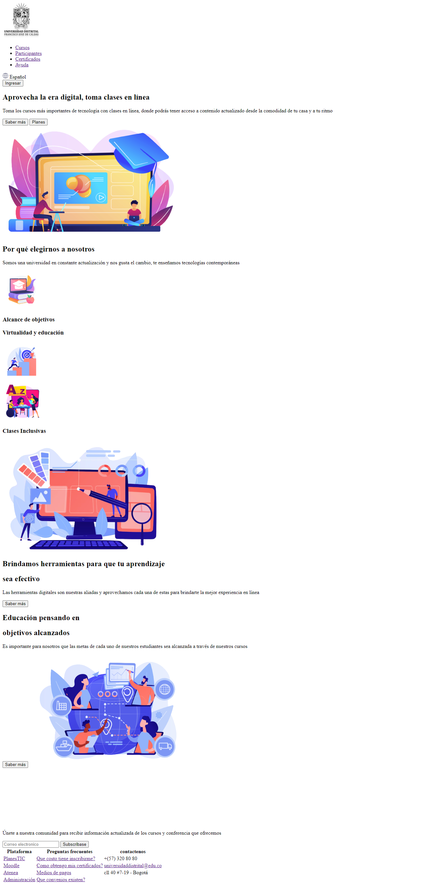
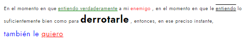
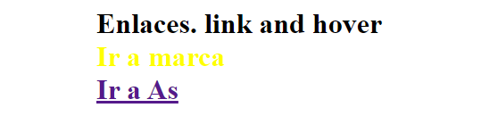
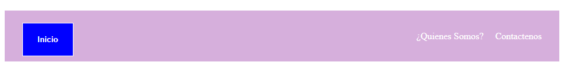
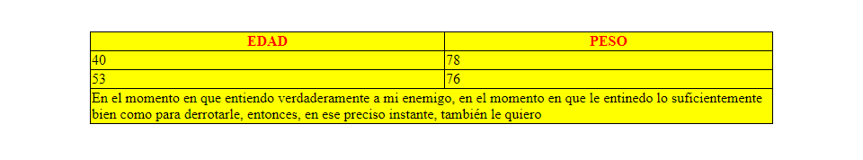

<h1>Taller 9: Fabian Quevedo</h1>

<h2>Información</h2>

Curso: Full Stack Básico - Grupo 1

Profesor: Cristian Patiño

<h2>Punto 1: Link de figma</h2>
<a href="https://www.figma.com/file/7v4EzA8Zb10esAeG9fv4CZ/Fabian-Quevedo-Figma-Excercise?type=design&node-id=0%3A1&mode=design&t=LeDJN1hDHckst06B-1">Link de Figma</a>

<h2>Punto 2: HTML<h2>

<h2>Punto 3: CSS<h2>

<h2>Punto 4: TEXTO<h2>

<h2>Punto 5: TEXTO<h2>

<h2>Punto 6: TEXTO<h2>

<h2>Punto 7-8: TEXTO<h2>

<h2>Punto 9: TABLA<h2>

